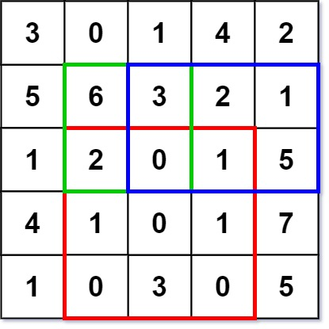

# [Range Sum Query 2D - Immutable](https://leetcode.com/problems/range-sum-query-2d-immutable/)

## Description

Given a 2D matrix `matrix`, handle multiple queries of the following type:

* Calculate the sum of the elements of `matrix` inside the rectangle defined by its upper left corner `(row1, col1)` and
  lower right corner `(row2, col2)`.

Implement the `NumMatrix` class:

* `NumMatrix(int[][] matrix)` Initializes the object with the integer matrix `matrix`.
* `int sumRegion(int row1, int col1, int row2, int col2)` Returns the sum of the elements of `matrix` inside the
  rectangle defined by its upper left corner `(row1, col1)` and lower right corner `(row2, col2)`.

You must design an algorithm where sumRegion works on O(1) time complexity.

Example 1:\
\
Input:

```
["NumMatrix", "sumRegion", "sumRegion", "sumRegion"]
[[[[3, 0, 1, 4, 2], [5, 6, 3, 2, 1], [1, 2, 0, 1, 5], [4, 1, 0, 1, 7], [1, 0, 3, 0, 5]]], [2, 1, 4, 3], [1, 1, 2, 2], [1, 2, 2, 4]]
```

Output:

```
[null, 8, 11, 12]
```

Explanation:

```
NumMatrix numMatrix = new NumMatrix([[3, 0, 1, 4, 2], [5, 6, 3, 2, 1], [1, 2, 0, 1, 5], [4, 1, 0, 1, 7], [1, 0, 3, 0, 5]]);
numMatrix.sumRegion(2, 1, 4, 3); // return 8 (i.e sum of the red rectangle)
numMatrix.sumRegion(1, 1, 2, 2); // return 11 (i.e sum of the green rectangle)
numMatrix.sumRegion(1, 2, 2, 4); // return 12 (i.e sum of the blue rectangle)
```

## Run Command

`poetry run python "1. Arrays/5. Prefix Sums/2. Range Sum Query 2D Immutable/range_sum_query_2D_immutable.py"`